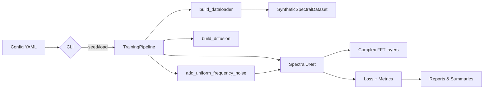

# Spectral Diffusion Architecture Overview

## Entry Points & Orchestration
- **`main.py` / `train.py` / `train_model.py`**: Thin wrappers that delegate to the CLI layer so experiments, legacy scripts, and split workflows share the same plumbing.【F:main.py†L1-L27】【F:train.py†L1-L6】【F:train_model.py†L1-L10】
- **CLI (`src/cli`)**: `train.py` loads YAML configs, seeds RNGs, prepares run directories, and invokes the unified `TrainingPipeline`; `evaluate.py` handles folder-based metrics; `sample.py` drives sampling routines.【F:src/cli/train.py†L10-L199】
- **Reporting scripts (`scripts/`)**: Shell and Python utilities orchestrate large sweeps, Taguchi analyses, and diagnostic captures (e.g., `scripts/debug/record_training_steps.py`).【F:scripts/debug/record_training_steps.py†L1-L200】

## Core Modules
- **Spectral transforms (`src/spectral`)**: FFT helpers, complex layers, and the `add_uniform_frequency_noise` routine that injects frequency-weighted noise during diffusion steps.【F:src/spectral/fft_adapter.py†L12-L210】【F:src/spectral/fft_utils.py†L6-L62】
- **Models (`src/core`)**: Spectral UNet variants built from complex convolutions, time embeddings, and optional amplitude/phase refiners.【F:src/core/model_unet_spectral.py†L1-L200】
- **Training orchestration (`src/training`)**: `TrainingPipeline` instantiates dataloaders, optimizers, diffusion schedules, and wraps the training loop plus diagnostics and Taguchi-aware logging.【F:src/training/pipeline.py†L1-L200】
- **Data (`src/training/data` & `src/data`)**: Procedural spectral dataset definitions and dataloader builders that switch between synthetic and CIFAR-10 sources at runtime.【F:src/training/data/synthetic_dataset.py†L1-L120】【F:src/training/builders.py†L16-L200】
- **Evaluation (`src/evaluation`)**: Pixel-space and spectral metrics (MSE, MAE, PSNR, high-frequency PSNR, optional FID/LPIPS) and dataset comparators.【F:src/evaluation/metrics.py†L1-L160】
- **Analysis & reporting (`src/analysis`, `src/reporting`, `src/visualization`)**: Taguchi post-processing, Markdown report generation, and plotting helpers for sweep deliverables.【F:src/analysis/taguchi_stats.py†L1-L200】

## Data Flow

- Config files and CLI arguments resolve into structured configs, run directories, and logging handles.【F:src/cli/common.py†L18-L195】【F:src/cli/train.py†L102-L199】
- `TrainingPipeline.run` samples timesteps, builds noise with `add_uniform_frequency_noise`, forwards through the UNet, and records losses/diagnostics for downstream reporting.【F:src/training/pipeline.py†L63-L200】
- Dataset builders emit paired (image, target) tensors; CIFAR data is wrapped to use self-reconstruction objectives.【F:src/training/builders.py†L16-L200】
- Report artefacts (summaries, configs, figures) are now consolidated by `HDF5ReportPackager`, making `results/full_report_*` consumable as a single archive for later figure generation.【F:src/reporting/hdf5_packager.py†L1-L235】

## Dependency Structure
Internal imports cluster around three hubs: spectral math, model core, and training pipeline.
- Spectral modules feed both the models and the pipeline for noise synthesis.【F:src/training/pipeline.py†L18-L150】
- CLI modules depend on training, evaluation, and shared utilities, but domain-specific code rarely reaches back into CLI, keeping user interface concerns isolated.【F:src/cli/train.py†L10-L199】
- Reporting/visualization layers depend on utilities and analysis modules, not on training internals, enabling offline report generation.【F:src/analysis/taguchi_stats.py†L1-L200】

## Configuration & Experimentation
- YAML configs under `configs/` (e.g., `baseline.yaml`, Taguchi matrices) define data source, model variant, diffusion schedule, and spectral knobs; the CLI records snapshots for reproducibility and appends summaries for later analysis.【F:src/cli/common.py†L18-L195】
- Taguchi tooling reads `summary.csv`, resolves per-run configs, and ranks factor deltas, enabling structured experimental design workflows.【F:src/analysis/taguchi_stats.py†L99-L182】

## Testing Surface
- `tests/` contains 28 targeted modules covering CLI plumbing, spectral layers, datasets, and report generation, providing a regression safety net for the critical abstractions observed above.【F:tests/test_training_pipeline.py†L1-L200】【4832b2†L1-L9】
