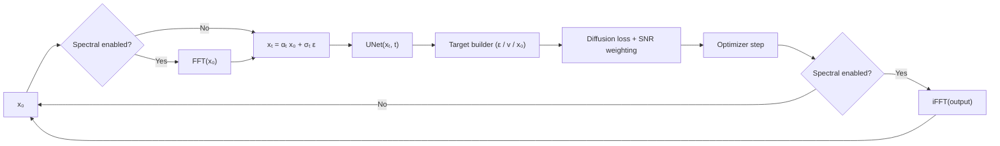
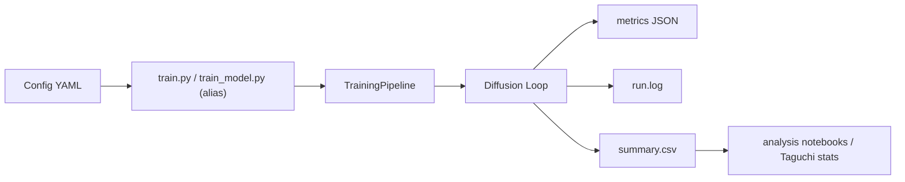
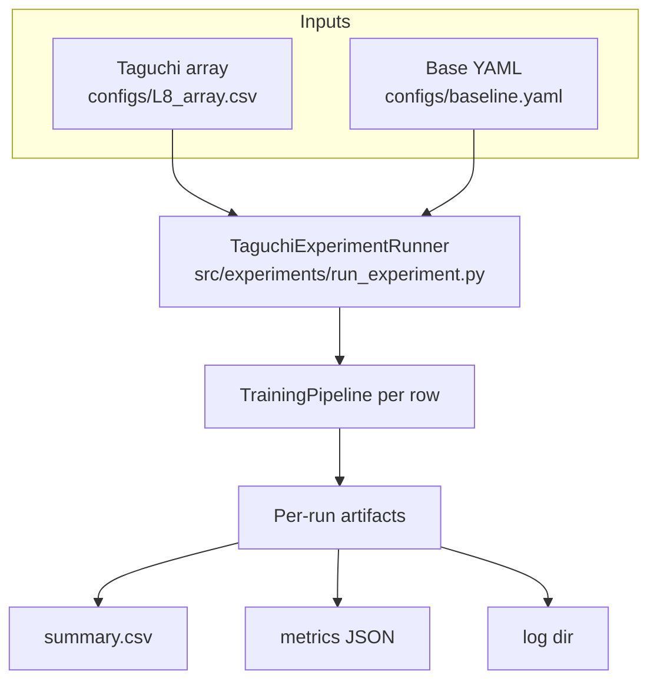
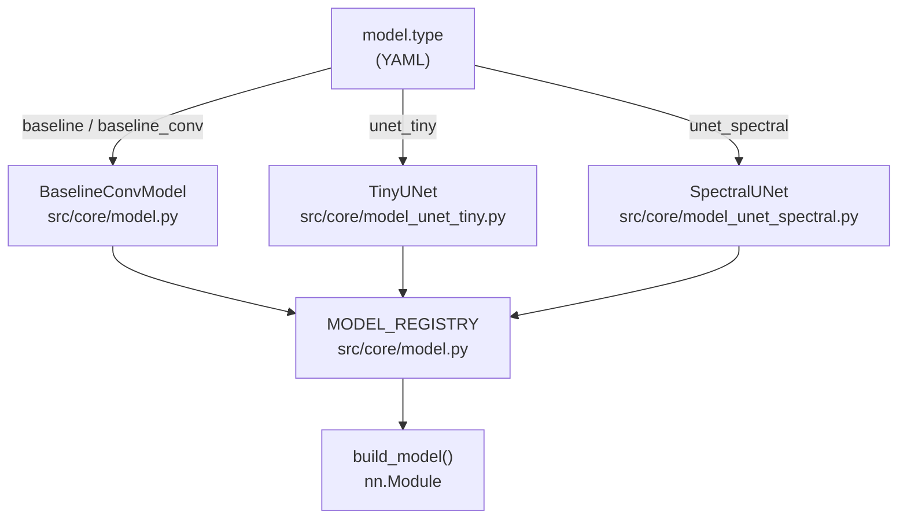
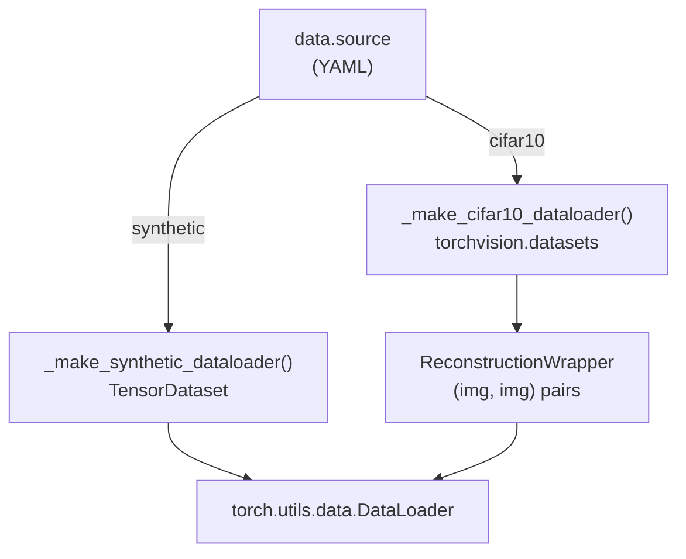

# 🌀 Spectral Diffusion

### Exploring frequency-space representations and alternative optimization schemes for diffusion models

---

## 🧭 Overview

**Spectral Diffusion** investigates how frequency-domain processing changes diffusion-model behaviour and efficiency. The codebase now includes:

- A diffusion-ready UNet (timestep conditioning, optional spectral pre/post transforms)
- Unified training pipeline with cosine β schedule, ε-prediction, and optional SNR weighting
- Taguchi batch runner that persists per-run configs/metrics for downstream analysis
- Instrumentation for throughput (`images_per_second`) and convergence speed (`loss_drop_per_second`) across variants

---

## 🎯 Project Goals

1. **Baseline:** Build and benchmark a standard diffusion pipeline (DDPM/DDIM).  
2. **Frequency-space methods:**  
   - Equalized noise injection  
   - Band-specific denoising  
   - Phase-preserving reconstruction  
3. **Optimization experiments:**  
   - Classic gradient descent vs. flow-matching vs. implicit equilibrium updates  
4. **Automation:**  
   - Run structured experiments via YAML + orthogonal arrays  
   - Compute Taguchi signal-to-noise ratios to identify dominant factors  
5. **Evaluation:**  
   - Track FID, LPIPS, runtime, and spectral consistency across runs

---

## ⚙️ Repository Structure
```
spectral-diffusion/
├── src/
│   ├── core/                # Model architectures and losses
│   ├── spectral/            # Frequency transforms and band utilities
│   ├── training/            # Unified training pipeline (baseline + variants)
│   ├── evaluation/          # Metrics, FID, LPIPS, runtime
│   └── experiments/         # Taguchi automation scripts
├── configs/
│   ├── baseline.yaml
│   ├── variants.yaml
│   └── L8_array.csv
├── notebooks/               # Analysis and visualization
├── results/
│   ├── metrics/
│   └── images/
└── README.md
```
---

## 🧪 Experimental Design

Taguchi-style orthogonal arrays drive controlled sweeps. Each CSV row maps to overrides in `TaguchiExperimentRunner._build_config_from_row`, so variants share the unified diffusion pipeline while toggling spectral options or sampler strategies.

---

## 📊 Key Metrics

| Metric | Description |
|--------|--------------|
| **loss_drop_per_second** | Convergence efficiency (higher is better) |
| **images_per_second** | Throughput under current config/hardware |
| **spectral_time_seconds** | Cumulative FFT overhead per run |
| **loss_threshold_time** | Wall time to reach configured target loss (if set) |
| **FID / LPIPS** | (Coming soon) image quality comparators for sampled images |

---

## 🚀 Quick Start

```bash
git clone https://github.com/benschneider/spectral-diffusion.git
cd spectral-diffusion
pip install -r requirements.txt
# Optional: fetch CIFAR-10 locally (or set data.download: true in configs)
mkdir -p data
curl -L https://www.cs.toronto.edu/~kriz/cifar-10-python.tar.gz -o data/cifar-10-python.tar.gz
tar -xzf data/cifar-10-python.tar.gz -C data
RUN_ID=quickstart
python train.py --config configs/baseline.yaml --run-id "$RUN_ID" --dry-run   # sanity check
python train.py --config configs/baseline.yaml --run-id "$RUN_ID"             # diffusion training (ε-pred)
python sample.py --run-dir results/runs/"$RUN_ID" --sampler-type dpm_solver++ --tag quickstart_solver --num-samples 8 --num-steps 50
# Optional: evaluate samples against a reference folder
python evaluate.py --generated-dir results/runs/"$RUN_ID"/samples/quickstart_solver --reference-dir path/to/reference --use-lpips
# Legacy alias (still supported): python train_model.py ...
# Optional Taguchi batch
python -m src.experiments.run_experiment
# Validation helper (removes dry-run artifacts unless --keep-artifacts is provided)
python validate_setup.py
# Benchmark baseline vs spectral throughput
python benchmarks/benchmark_fft.py --device cpu --batch-size 16
# Fully automated smoke test (synthetic, fast)
scripts/run_smoke_test.sh
# Clean generated run artifacts (preserves summary unless --wipe-summary)
scripts/clean_results.sh
# Taguchi spectral sweep (CIFAR-10 quick pass)
scripts/run_taguchi_smoke.sh
# Taguchi comparison run (CIFAR-10, spectral vs baseline)
scripts/run_taguchi_comparison.sh
# Taguchi minimal sweep (tiny synthetic model)
scripts/run_taguchi_minimal.sh
# Quick spectral vs baseline benchmark (synthetic, spectral UNet vs TinyUNet)
scripts/run_spectral_benchmark.sh
# (See configs/taguchi_minimal_base.yaml for the miniature UNet + synthetic data setup)
# Summarise latest runs (top-5 by loss_drop_per_second)
scripts/report_summary.py --metric loss_drop_per_second --top 5 --include-factors
# (Set OMP_NUM_THREADS=1 if your environment restricts shared-memory allocs)
```

Results are rooted at `results/` by default:

- `results/summary.csv` – append-only ledger of run metrics.
- `results/runs/<run_id>/config.yaml` – frozen config snapshot.
- `results/runs/<run_id>/logs/train.log` – per-run log.
- `results/runs/<run_id>/metrics/<run_id>.json` – structured metrics.
- `results/runs/<run_id>/checkpoints/*.pt` – saved model weights.
- `results/runs/<run_id>/samples/<tag>/` – generated images, `grid.png`, and `metadata.json` describing sampler parameters and evaluation results.
- `results/runs/<run_id>/system.json` – captured environment metadata (platform, Python/Torch version, device availability).

---

## 🧰 Current Capabilities

- Diffusion-ready TinyUNet (cosine β schedule, ε-prediction, optional SNR weighting, spectral pre/post transforms).
- Throughput & convergence instrumentation (`steps_per_second`, `images_per_second`, `loss_drop_per_second`, loss-threshold timings).
- Taguchi batch runner producing reproducible artifacts (config snapshot, metrics JSON, log folder, summary ledger).
- FFT benchmarking harness for baseline vs spectral forward-pass comparisons.
- Validation script covering dry and short runs, with automatic cleanup.

## 🛠 Usage Notes

- **Enable spectral processing:** set `spectral.enabled: true`, choose `spectral.weighting` (`none`, `radial`, `bandpass`), and configure `spectral.apply_to` (`input`, `output`, or both) plus `spectral.per_block` if you want adapters around each UNet block.
- **Spectral-weighted losses:** set `loss.spectral_weighting` (`none`, `radial`, `bandpass`) to apply weighting in frequency space before the MSE reduction. Adjust `loss.bandpass_inner/outer` to tune the bandpass mask.
- **Spectral factors in Taguchi arrays:** see `configs/taguchi_spectral_array.csv` + `configs/taguchi_spectral_array.yaml.md` for how factors `A..D` map to `spectral.enabled`, `spectral.weighting`, `loss.spectral_weighting`, and `sampling.sampler_type`.
- **Generate samples:** after training, run `sample.py --run-dir results/runs/<run_id> --sampler-type <ddpm|ddim|dpm_solver++>` to write images and metadata under `samples/<tag>/`.
- **Evaluate samples:** use `evaluate.py --generated-dir ... --reference-dir ... --use-fid --use-lpips` to compute pixel metrics plus FID/LPIPS (when torchmetrics is installed). The metrics JSON is stored alongside the samples and, when `--update-metadata` is set, persisted in `metadata.json`.
- **Try the spectral UNet:** set `model.type: unet_spectral` (optionally adjust `base_channels`) to train the complex-valued SpectralUNet prototype described in `docs/spectral_model_research.md`.
- **Analyze Taguchi batches:** once `results/summary.csv` has multiple runs, generate factor S/N rankings with `python -m src.analysis.taguchi_stats --summary results/summary.csv --metric loss_drop_per_second --mode larger --output results/taguchi_report.csv`.
- **Tune diffusion behaviour:** edit the `diffusion` block (`num_timesteps`, `beta_schedule`, `prediction_type`, `snr_weighting`, `loss_threshold`, `time_embed_dim`).
- **Run Taguchi sweeps:** keep base settings in `configs/baseline.yaml`, adjust factors in `configs/L8_array.csv`, and execute `python -m src.experiments.run_experiment`.
- **Inspect results:** per-run artifacts live in `results/runs/<run_id>/...`; `results/summary.csv` aggregates efficiency data for notebooks and dashboards.
- **Benchmarks & tests:** run `python benchmarks/benchmark_fft.py ...` for forward throughput and `python -m pytest tests/test_*` for unit coverage.
- **Evaluate image quality:** call `compute_dataset_metrics` from `src.evaluation.metrics` to score generated vs reference folders (MSE/MAE/PSNR, optional FID when torchmetrics is installed).

---

## 🔄 Flow Overview

### Conceptual Diffusion Cycle



This highlights the shared diffusion loop. Spectral toggles route data through FFT/iFFT while reusing the same timestep-conditioned UNet.

### System Flow (Single Run)



### Experiment Flow (Batch Runs)



Each design-row produces its own run ID, config snapshot, metrics JSON, and an entry in `results/summary.csv`. Aggregated Taguchi S/N analysis will build on these artifacts.

### Model Variant Dispatch



- `train.py` (and the legacy alias `train_model.py`) passes the full config to `build_model()` (`src/core/model.py`).
- `MODEL_REGISTRY` maps type strings to constructors. Register additional architectures here.
- `BaselineConvModel` suits synthetic smoke tests; `TinyUNet` targets 32×32 CIFAR-10 reconstructions; `SpectralUNet` operates directly on frequency-domain representations using complex convolutions.

### Data Source Selection



- Synthetic mode generates random tensors sized by `data.channels/height/width`, limiting iterations with `training.num_batches`.
- CIFAR-10 mode expects `data.root/cifar-10-batches-py` (or `data.download: true`) and wraps samples so the reconstruction loss applies.
- Spectral toggles live under `spectral.*` in the config (`enabled`, `normalize`, `weighting` ∈ {`none`, `radial`, `bandpass`}); when enabled, the model performs an FFT → optional weighting → inverse FFT round-trip before and after the UNet.

### What Gets Logged & How to Read It

- `results/runs/<run_id>/config.yaml` – frozen effective configuration (exactly what the run saw).
- `results/runs/<run_id>/logs/train.log` – chronological training messages (loss snapshots, runtime, warnings).
- `results/runs/<run_id>/metrics/<run_id>.json` – structured metrics:
  - `loss_mean`, `loss_last`, `mae_mean` → reconstruction quality proxies.
  - `runtime_seconds`, `num_steps`, `epochs` → throughput and coverage.
  - `steps_per_second`, `images_per_second`, `runtime_per_epoch` → throughput/efficiency.
  - `loss_initial`, `loss_final`, `loss_drop`, `loss_drop_per_second` → convergence speed indicators.
  - `loss_threshold_*` entries record when a configured target loss is reached (if provided).
  - `spectral_calls`, `spectral_time_seconds` → FFT usage/overhead when spectral mode is enabled.
- `results/runs/<run_id>/checkpoints/` – model weights saved during/after training.
- `results/runs/<run_id>/samples/<tag>/` – generated images (`grid.png`, `sample_*.png`) plus `metadata.json` describing sampler settings and evaluation results.
- `results/summary.csv` – append-only ledger linking run IDs to config/metrics; Taguchi batches append here automatically.
- `validate_setup.py` removes its dry-run artifacts by default; pass `--keep-artifacts` to inspect them.

> ❗️Still in progress:
> - Spectral transforms (FFT pipeline), diffusion-specific losses/schedulers, and perceptual metrics (FID/LPIPS) remain placeholders.
> - Taguchi experiment runner analysis (factor ranking, S/N ratios) is the next milestone.

### Baseline vs. Spectral Snapshot

| Aspect | Baseline (`baseline_conv`) | Spectral (current/roadmap) |
|--------|----------------------------|----------------------------|
| Domain | Pixel / spatial            | Frequency (FFT round-trip) |
| Noise | Standard Gaussian           | Frequency-equalized noise (future) |
| Attention | None                     | Frequency attention toggle (future) |
| Loss | Reconstruction MSE / MAE     | Band-aware diffusion loss (TODO) |
| Config toggle | `spectral.enabled: false` | `spectral.enabled: true` + `weighting: radial/bandpass` |
| Goal | Stability + quick testing    | Probe spectral benefits, Taguchi optimization |

---

## Spectral Model Research Plan

Refer to `docs/spectral_model_research.md` for the detailed roadmap covering complex convolution layers, spectral UNet architecture prototypes, experiment stages, and risks/mitigations. The document outlines how upcoming development will extend the current spatial UNet into a native frequency-domain model while reusing the new sampler and evaluation tooling documented above.

## 🧠 Research Questions
- Does learning in frequency space reduce redundancy in denoising trajectories?
- Can adaptive noise equalization stabilize or accelerate convergence?
- Are hybrid flow/ODE methods preferable to iterative diffusion in high-frequency domains?
- What combination of parameters (Taguchi analysis) yields the best trade-off between speed and fidelity?

---

## 📄 License

MIT License © 2025 Ben Schneider


## 💡 Citation

If you use this repository in academic work, please cite it as:

```
@software{spectral_diffusion_2025,
  author = {Ben Schneider},
  title = {Spectral Diffusion: Frequency-Space Diffusion Experiments},
  year = {2025},
  url = {https://github.com/benschneider/spectral-diffusion}
}
```
