# 🌀 Spectral Diffusion

### Exploring frequency-space representations and alternative optimization schemes for diffusion models

---

## 🧭 Overview

**Spectral Diffusion** investigates how operating in **frequency space**—via Fourier or wavelet transforms—affects the behavior, stability, and efficiency of diffusion-based generative models.  
Instead of the usual pixel-domain denoising, we explore **multi-band**, **frequency-aware**, and **adaptive noise** techniques to improve sample quality and reduce computational cost.

This repository provides a flexible framework to:

- Prototype and compare baseline vs. spectral variants of diffusion models  
- Test **non-iterative** or **hybrid flow-matching** approaches  
- Automate experiments with a **Taguchi-inspired design**, minimizing the number of runs while maximizing insight

---

## 🎯 Project Goals

1. **Baseline:** Build and benchmark a standard diffusion pipeline (DDPM/DDIM).  
2. **Frequency-space methods:**  
   - Equalized noise injection  
   - Band-specific denoising  
   - Phase-preserving reconstruction  
3. **Optimization experiments:**  
   - Classic gradient descent vs. flow-matching vs. implicit equilibrium updates  
4. **Automation:**  
   - Run structured experiments via YAML + orthogonal arrays  
   - Compute Taguchi signal-to-noise ratios to identify dominant factors  
5. **Evaluation:**  
   - Track FID, LPIPS, runtime, and spectral consistency across runs

---

## ⚙️ Repository Structure
```
spectral-diffusion/
├── src/
│   ├── core/                # Model architectures and losses
│   ├── spectral/            # Frequency transforms and band utilities
│   ├── training/            # Unified training pipeline (baseline + variants)
│   ├── evaluation/          # Metrics, FID, LPIPS, runtime
│   └── experiments/         # Taguchi automation scripts
├── configs/
│   ├── baseline.yaml
│   ├── variants.yaml
│   └── L8_array.csv
├── notebooks/               # Analysis and visualization
├── results/
│   ├── metrics/
│   └── images/
└── README.md
```
---

## 🧪 Experimental Design

We use a **Taguchi-style factorial design** to minimize test count.

| Factor | Description | Levels |
|--------|--------------|--------|
| A | Frequency-equalized noise | Off / On |
| B | Frequency attention | Off / On |
| C | Sampler type | DDIM / DPM-Solver++ |
| D | Loss weighting | Standard / Frequency-balanced |
| E | Optimizer | Adam / Custom adaptive |

Each run logs its configuration and metrics to allow automatic ranking of factor influence.

---

## 📊 Evaluation Metrics

| Metric | Description |
|--------|--------------|
| **FID** | Measures realism vs. reference distribution |
| **LPIPS** | Perceptual similarity for visual fidelity |
| **Runtime** | Training and inference speed |
| **Spectral MSE** | Difference between power spectra of generated vs. real samples |

---

## 🚀 Quick Start

```bash
git clone https://github.com/benschneider/spectral-diffusion.git
cd spectral-diffusion
pip install -r requirements.txt
# Optional: fetch CIFAR-10 locally (or set data.download: true in configs)
mkdir -p data
curl -L https://www.cs.toronto.edu/~kriz/cifar-10-python.tar.gz -o data/cifar-10-python.tar.gz
tar -xzf data/cifar-10-python.tar.gz -C data
python train_model.py --config configs/baseline.yaml --dry-run   # sanity check
python train_model.py --config configs/baseline.yaml              # full placeholder run
# Optional Taguchi batch
python -m src.experiments.run_experiment
```

Results and metrics will appear in `results/summary.csv`.

---

## 🔄 Flow Overview

### Conceptual Diffusion Cycle

```mermaid
flowchart LR
    A["Input sample"] --> B["FFT / Spectral transform<br/>(optional)"]
    B --> C["Model predicts noise / score<br/>(Baseline or Spectral)"]
    C --> D["Inverse transform<br/>(if spectral branch)"]
    D --> E["Loss computation<br/>MSE · MAE · future spectral losses"]
    E --> F["Optimizer update"]
    F --> B
```



This cycle highlights the shared training loop. The spectral branch (FFT and inverse FFT) is wired but still a no-op until the spectral utilities are upgraded.

### System Flow (Single Run)


### Experiment Flow (Batch Runs)


The runner currently aggregates results in memory. The TODO list includes appending each run to `results/summary.csv` for full reproducibility.

### Model Variant Dispatch


- `train_model.py` passes the full config to `build_model()` (`src/core/model.py`).
- `MODEL_REGISTRY` maps type strings to constructors. Register additional architectures here.
- `BaselineConvModel` suits synthetic smoke tests; `TinyUNet` targets 32×32 CIFAR-10 reconstructions.

### Data Source Selection


- Synthetic mode generates random tensors sized by `data.channels/height/width`, limiting iterations with `training.num_batches`.
- CIFAR-10 mode expects `data.root/cifar-10-batches-py` (or `data.download: true`) and wraps samples so the reconstruction loss applies.

### What Gets Logged & How to Read It

- `results/logs/<run_id>/run.log` – chronological training messages (loss snapshots, runtime).
- `results/logs/<run_id>/config.yaml` – frozen effective configuration.
- `results/metrics/<run_id>.json` – structured metrics:
  - `loss_mean`, `loss_last`, `mae_mean` → reconstruction quality proxies.
  - `runtime_seconds`, `num_steps`, `epochs` → throughput and coverage.
- `results/summary.csv` – append-only ledger linking run IDs to config/metrics; Taguchi batches will soon write here automatically.

> ❗️Still in progress:
> - Spectral transforms (FFT pipeline), diffusion-specific losses/schedulers, and perceptual metrics (FID/LPIPS) remain placeholders.
> - Taguchi experiment runner currently keeps results in memory; persistence into the summary log is queued next.

### Baseline vs. Spectral Snapshot

| Aspect | Baseline (`baseline_conv`) | Spectral (planned) |
|--------|----------------------------|--------------------|
| Domain | Pixel / spatial            | Frequency (FFT)    |
| Noise | Standard Gaussian           | Frequency-equalized noise |
| Attention | None                     | Frequency attention toggle |
| Loss | Reconstruction MSE / MAE     | Band-aware diffusion loss (TODO) |
| Goal | Stability + quick testing    | Probe spectral benefits, Taguchi optimization |

---

## 🧠 Research Questions
- Does learning in frequency space reduce redundancy in denoising trajectories?
- Can adaptive noise equalization stabilize or accelerate convergence?
- Are hybrid flow/ODE methods preferable to iterative diffusion in high-frequency domains?
- What combination of parameters (Taguchi analysis) yields the best trade-off between speed and fidelity?

---

## 📄 License

MIT License © 2025 Ben Schneider


## 💡 Citation

If you use this repository in academic work, please cite it as:

```
@software{spectral_diffusion_2025,
  author = {Ben Schneider},
  title = {Spectral Diffusion: Frequency-Space Diffusion Experiments},
  year = {2025},
  url = {https://github.com/benschneider/spectral-diffusion}
}
```
