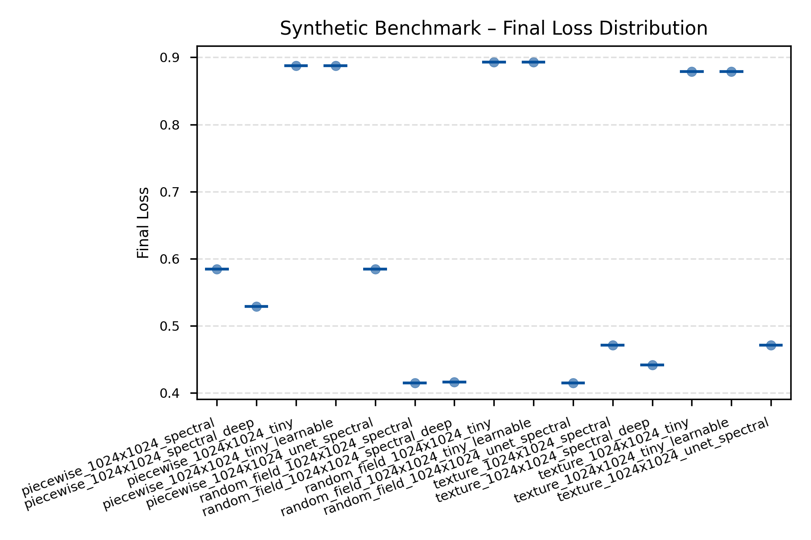

# Results Summary

_Generated 2025-10-26T00:14:46+00:00_
_Source: /Users/benschneider/gitrep/spectral-diffusion/results/full_report_1024x_20251025_152806_

## Synthetic Benchmark (generate different type of images, piecewise, parametric textures, random fields)
We compare how quickly the spatial TinyUNet and the spectral version learn to reconstruct tiny synthetic images. 

**Data families tested:**
- **Piecewise**: Structured patterns (checkerboards, stripes, circles) - tests discrete spatial feature learning
- **Texture**: Parametric gratings (oriented, controlled frequency/bandwidth) - tests directional frequency sensitivity
- **Random field**: Power-law spectra (1/f^α falloff) - tests natural image frequency statistics

| Run | Loss Drop | Final Loss | Images/s | Runtime (s) | FID |
| --- | --- | --- | --- | --- | --- |
| piecewise_1024x1024_tiny | 0.126 | 0.888 | 470.4 | 3.4 | – |
| piecewise_1024x1024_tiny_learnable | 0.126 | 0.888 | 492.5 | 3.2 | – |
| piecewise_1024x1024_spectral | 2.567 | 0.584 | 37.7 | 42.4 | – |
| piecewise_1024x1024_spectral_deep | 1.773 | 0.529 | 16.7 | 95.6 | – |
| piecewise_1024x1024_unet_spectral | 2.567 | 0.584 | 43.1 | 37.2 | – |
| texture_1024x1024_tiny | 0.133 | 0.879 | 503.4 | 3.2 | – |
| texture_1024x1024_tiny_learnable | 0.133 | 0.879 | 505.1 | 3.2 | – |
| texture_1024x1024_spectral | 2.840 | 0.471 | 42.8 | 37.4 | – |
| texture_1024x1024_spectral_deep | 1.860 | 0.441 | 16.7 | 95.8 | – |
| texture_1024x1024_unet_spectral | 2.840 | 0.471 | 41.2 | 38.9 | – |
| random_field_1024x1024_tiny | 0.107 | 0.893 | 494.1 | 3.2 | – |
| random_field_1024x1024_tiny_learnable | 0.107 | 0.893 | 490.9 | 3.3 | – |
| random_field_1024x1024_spectral | 2.959 | 0.414 | 41.6 | 38.4 | – |
| random_field_1024x1024_spectral_deep | 1.824 | 0.416 | 16.2 | 99.0 | – |
| random_field_1024x1024_unet_spectral | 2.959 | 0.414 | 41.0 | 39.0 | – |

**Quick takeaways**
- Lowest final loss: random_field_1024x1024_spectral (0.414)
- Fastest throughput: texture_1024x1024_tiny_learnable (505.1) images/s
- Trade-off: texture_1024x1024_tiny_learnable vs random_field_1024x1024_spectral → 12.1× faster, Δ loss -0.464
- Fastest convergence: random_field_1024x1024_spectral (0.077) loss drop/s

## CIFAR-10 Reconstruction Benchmark
Same comparison on real CIFAR-10 data to show the accuracy vs. training speed trade-off.

| Run | Loss Drop | Final Loss | Images/s | Runtime (s) | FID |
| --- | --- | --- | --- | --- | --- |
| cifar_1024x1024_tiny | 0.941 | 0.182 | 89.9 | 71.2 | – |
| cifar_1024x1024_spectral | 2.942 | 0.357 | 41.0 | 155.9 | – |
| cifar_1024x1024_spectral_deep | 1.699 | 0.278 | 21.8 | 293.7 | – |

**Quick takeaways**
- Lowest final loss: cifar_1024x1024_tiny (0.182)
- Fastest throughput: cifar_1024x1024_tiny (89.9) images/s
- Fastest convergence: cifar_1024x1024_spectral (0.019) loss drop/s

## Taguchi Factor Sweep
We run a Taguchi orthogonal array to see which frequency-processing settings and sampler choices matter most for convergence speed.

| Rank | Factor | Level | S/N (dB) | Runtime (s) | Images/s | Final Loss |
| --- | --- | --- | --- | --- | --- | --- |
| 1 | Spectral attention | off | -30.33 | 21.282 | 90.22 | 0.483 |
| 1 | Spectral attention | on | -30.73 | 21.217 | 90.49 | 0.529 |
| 2 | Spectral adapters enabled | off | -30.38 | 21.266 | 90.29 | 0.508 |
| 2 | Spectral adapters enabled | on | -30.68 | 21.233 | 90.43 | 0.503 |
| 3 | Cross-domain init | random | -30.58 | 21.253 | 90.34 | 0.505 |

_Higher S/N (less negative) indicates a more robust configuration. Secondary columns show per-level averages for runtime, throughput, and final loss when available._

**Quick takeaways**
- Spectral attention best at off (-30.33 dB, Δ +0.39 dB vs. on, runtime 21.282s vs 21.217s, images/s 90.22 vs 90.49, final loss 0.483 vs 0.529)
- Spectral adapters enabled best at off (-30.38 dB, Δ +0.30 dB vs. on, runtime 21.266s vs 21.233s, images/s 90.29 vs 90.43, final loss 0.508 vs 0.503)
- Cross-domain init best at GPT-2 (-30.48 dB, Δ +0.10 dB vs. random, runtime 21.246s vs 21.253s, images/s 90.37 vs 90.34, final loss 0.507 vs 0.505)

## FFT Benchmark Snapshot
Parameters: batch=4, channels=3, size=256×256, runs=10
- torch.fft.fft2 (CPU): 3.19 ms per call (total 0.032s)
- numpy.fft.fft2: 8.96 ms per call (total 0.090s)
- torch.fft.fft2 (CUDA): not available on this machine
_One-off measurement on local hardware; treat as qualitative guidance._
