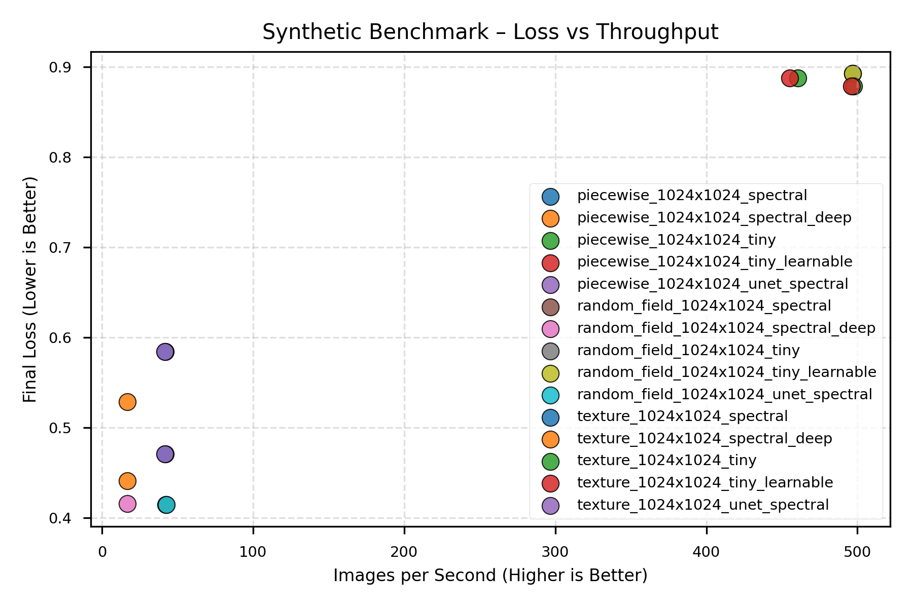
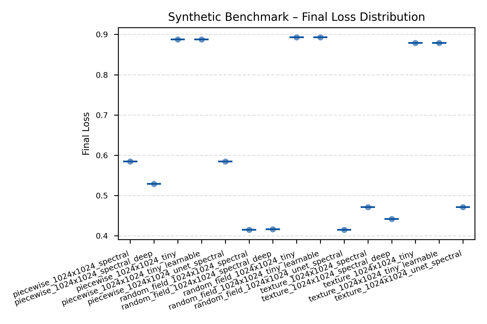
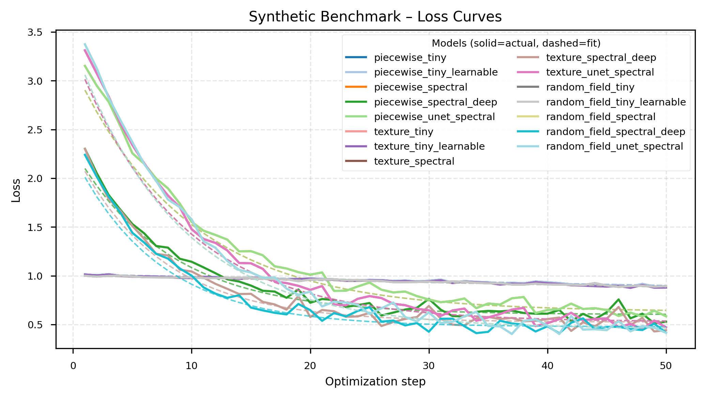
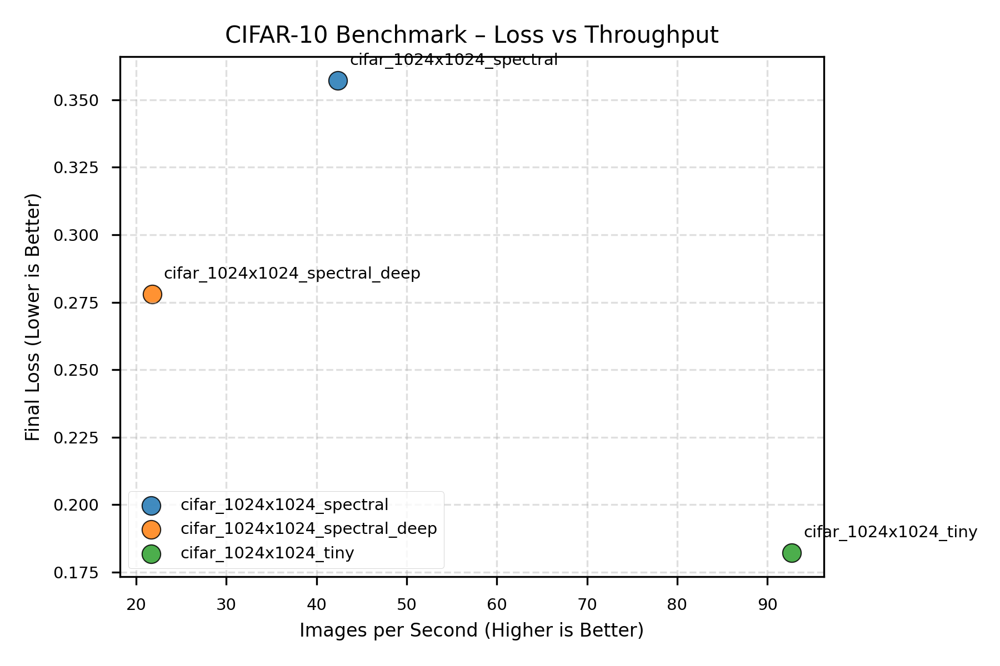
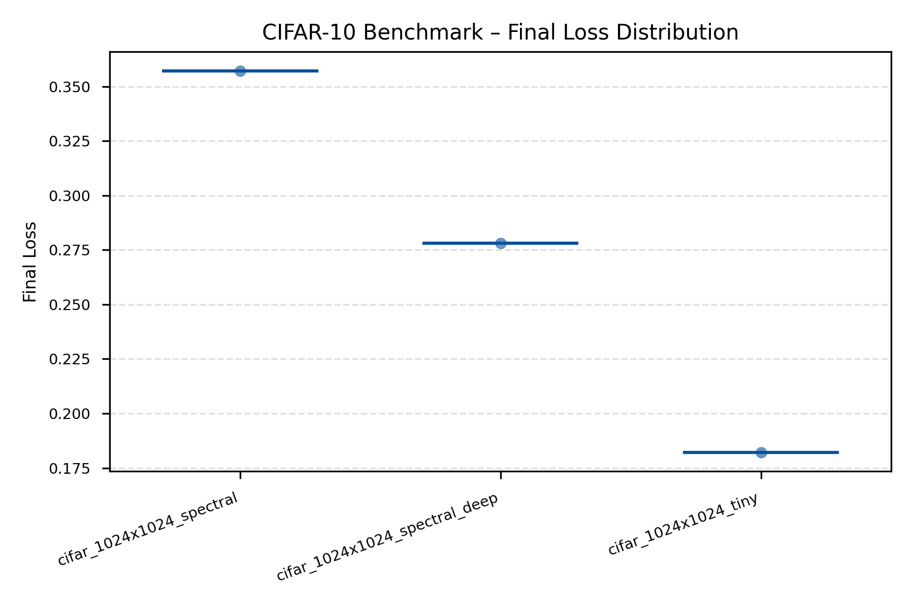
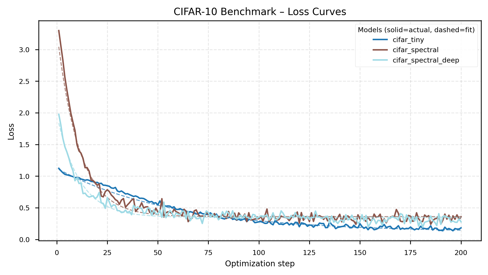
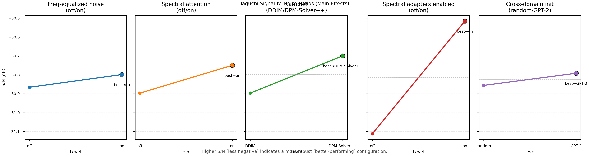
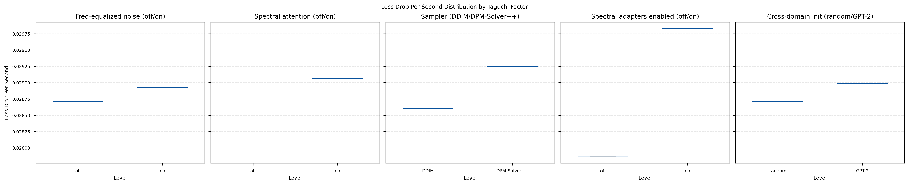

# Results Summary

_Generated 2025-10-26T18:08:45+00:00_
_Source: full_report_1024x_20251026_084856_

## Synthetic Benchmark (generate different type of images, piecewise, parametric textures, random fields)
We compare how quickly the spatial TinyUNet and the spectral version learn to reconstruct tiny synthetic images. 

**Data families tested:**
- **Piecewise**: Structured patterns (checkerboards, stripes, circles) - tests discrete spatial feature learning
- **Texture**: Parametric gratings (oriented, controlled frequency/bandwidth) - tests directional frequency sensitivity
- **Random field**: Power-law spectra (1/f^α falloff) - tests natural image frequency statistics

**FFT Performance Context:**
- torch.fft.fft2 (CPU): 3.8ms per 256×256 image
- numpy.fft.fft2: 9.6ms per 256×256 image

**⚠️ Implementation Caveat:**
Spectral adapters currently rely on Python-level FFT calls, causing host-device sync overhead.
Wall-time results are implementation-limited. Step-based fit-rate metrics (k, t½) are the primary
indicators of convergence efficiency. We benchmark the FFT performance in isolation.

| Run | Loss Drop | Final Loss | Images/s | Runtime (s) | Fit k | Fit R² | t½ | FID |
| --- | --- | --- | --- | --- | --- | --- | --- | --- |
| piecewise_1024x1024_tiny | 0.126 | 0.888 | 460.7 | 3.5 | – | – | – | – |
| piecewise_1024x1024_tiny_learnable | 0.126 | 0.888 | 455.1 | 3.5 | – | – | – | – |
| piecewise_1024x1024_spectral | 2.567 | 0.584 | 41.8 | 38.2 | – | – | – | – |
| piecewise_1024x1024_spectral_deep | 1.773 | 0.529 | 16.7 | 95.8 | – | – | – | – |
| piecewise_1024x1024_unet_spectral | 2.567 | 0.584 | 41.6 | 38.4 | – | – | – | – |
| texture_1024x1024_tiny | 0.133 | 0.879 | 497.6 | 3.2 | – | – | – | – |
| texture_1024x1024_tiny_learnable | 0.133 | 0.879 | 496.3 | 3.2 | – | – | – | – |
| texture_1024x1024_spectral | 2.840 | 0.471 | 42.1 | 38.0 | – | – | – | – |
| texture_1024x1024_spectral_deep | 1.860 | 0.441 | 16.7 | 95.8 | – | – | – | – |
| texture_1024x1024_unet_spectral | 2.840 | 0.471 | 41.6 | 38.4 | – | – | – | – |
| random_field_1024x1024_tiny | 0.107 | 0.893 | 496.7 | 3.2 | – | – | – | – |
| random_field_1024x1024_tiny_learnable | 0.107 | 0.893 | 496.9 | 3.2 | – | – | – | – |
| random_field_1024x1024_spectral | 2.959 | 0.414 | 42.2 | 37.9 | – | – | – | – |
| random_field_1024x1024_spectral_deep | 1.824 | 0.416 | 16.7 | 95.6 | – | – | – | – |
| random_field_1024x1024_unet_spectral | 2.959 | 0.414 | 42.5 | 37.6 | – | – | – | – |

**Quick takeaways**
- Lowest final loss: random_field_1024x1024_spectral (0.414)
- Fastest throughput: texture_1024x1024_tiny (497.6) images/s
- Trade-off: texture_1024x1024_tiny vs random_field_1024x1024_spectral → 11.8× faster, Δ loss -0.464
- Fastest convergence: random_field_1024x1024_unet_spectral (0.079) loss drop/s

## CIFAR-10 Reconstruction Benchmark
Same comparison on real CIFAR-10 data to show the accuracy vs. training speed trade-off.

| Run | Loss Drop | Final Loss | Images/s | Runtime (s) | Fit k | Fit R² | t½ | FID |
| --- | --- | --- | --- | --- | --- | --- | --- | --- |
| cifar_1024x1024_tiny | 0.941 | 0.182 | 92.7 | 69.0 | – | – | – | – |
| cifar_1024x1024_spectral | 2.942 | 0.357 | 42.4 | 151.0 | – | – | – | – |
| cifar_1024x1024_spectral_deep | 1.699 | 0.278 | 21.8 | 294.1 | – | – | – | – |

**Quick takeaways**
- Lowest final loss: cifar_1024x1024_tiny (0.182)
- Fastest throughput: cifar_1024x1024_tiny (92.7) images/s
- Fastest convergence: cifar_1024x1024_spectral (0.019) loss drop/s

## Taguchi Factor Sweep
We run a Taguchi orthogonal array to see which frequency-processing settings and sampler choices matter most for convergence speed.

| Rank | Factor | Level | S/N (dB) | Runtime (s) | Images/s | Final Loss |
| --- | --- | --- | --- | --- | --- | --- |
| 1 | Spectral adapters enabled | off | -31.11 | 21.184 | 90.71 | 0.501 |
| 1 | Spectral adapters enabled | on | -30.52 | 20.896 | 91.89 | 0.480 |
| 2 | Sampler | DDIM | -30.90 | 21.132 | 90.93 | 0.485 |
| 2 | Sampler | DPM-Solver++ | -30.70 | 20.887 | 91.93 | 0.500 |
| 3 | Spectral attention | off | -30.90 | 21.250 | 90.42 | 0.486 |

_Higher S/N (less negative) indicates a more robust configuration. Secondary columns show per-level averages for runtime, throughput, and final loss when available._

**Quick takeaways**
- Spectral adapters enabled best at on (-30.52 dB, Δ +0.60 dB vs. off, runtime 20.896s vs 21.184s, images/s 91.89 vs 90.71, final loss 0.480 vs 0.501)
- Sampler best at DPM-Solver++ (-30.70 dB, Δ +0.20 dB vs. DDIM, runtime 20.887s vs 21.132s, images/s 91.93 vs 90.93, final loss 0.500 vs 0.485)
- Spectral attention best at on (-30.75 dB, Δ +0.15 dB vs. off, runtime 20.830s vs 21.250s, images/s 92.18 vs 90.42, final loss 0.496 vs 0.486)

## FFT Benchmark Snapshot
Parameters: batch=4, channels=3, size=256×256, runs=10
- torch.fft.fft2 (CPU): 3.83 ms per call (total 0.038s)
- numpy.fft.fft2: 9.58 ms per call (total 0.096s)
- torch.fft.fft2 (CUDA): not available on this machine
_One-off measurement on local hardware; treat as qualitative guidance._

## FFT Overhead Correction
The benchmark suite measures transform overhead across resolutions.
FFT-corrected runtime t_corrected = t_measured × (1 - fft_fraction).
While not perfect, it allows theoretical extrapolation to GPU-native FFTs.
Scaling exponents p ≈ 1.8–2.0 indicate expected asymptotic flattening for spectral variants.

**⚠️ Implementation Caveat:**
Current spectral adapters use Python-level FFT calls, causing host-device sync overhead.
Wall-time results are implementation-limited. Step-based fit-rate metrics (k, t½) are the primary
indicators of convergence efficiency. We benchmark the FFT performance in isolation.

**📊 Scaling Analysis Methodology:**
- **FFT scaling:** Measured across resolutions 256² to 1536², fitted with power law time ~ N^p
- **Runtime scaling:** Training time vs resolution for baseline vs spectral models
- **Efficiency metrics:** k (convergence rate) and k/runtime (normalized efficiency)
- **FFT correction:** t_corrected = t_measured × (1 - fft_fraction) for fair comparison
