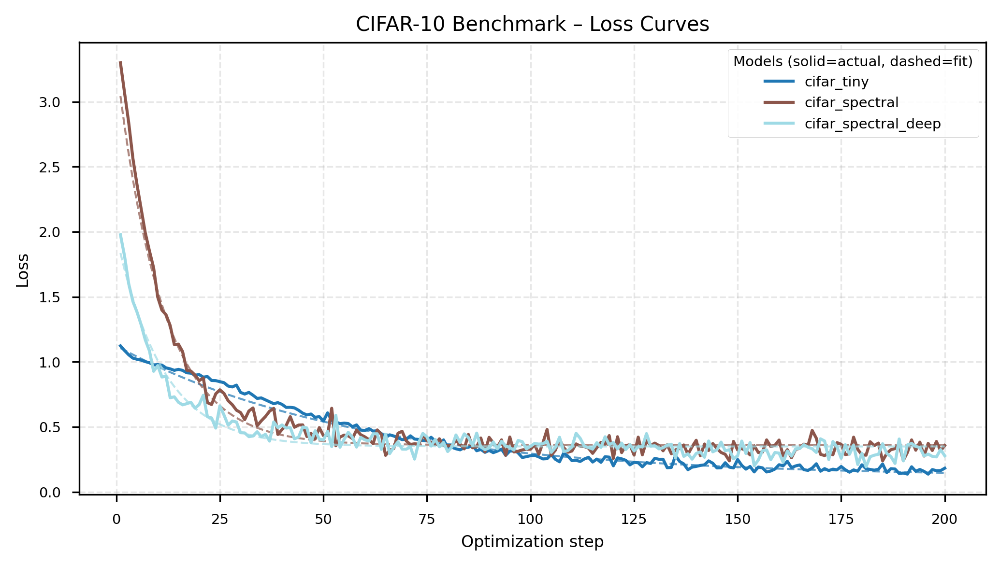

# Results Summary

_Generated 2025-10-25T22:06:55+00:00_
_Source: /Users/benschneider/gitrep/spectral-diffusion/results/full_report_32x32_20251025_142903_

## Synthetic Benchmark (generate different type of images, piecewise, parametric textures, random fields)
We compare how quickly the spatial TinyUNet and the spectral version learn to reconstruct tiny synthetic images. 

**Data families tested:**
- **Piecewise**: Structured patterns (checkerboards, stripes, circles) - tests discrete spatial feature learning
- **Texture**: Parametric gratings (oriented, controlled frequency/bandwidth) - tests directional frequency sensitivity
- **Random field**: Power-law spectra (1/f^α falloff) - tests natural image frequency statistics

| Run | Loss Drop | Final Loss | Images/s | Runtime (s) | FID |
| --- | --- | --- | --- | --- | --- |
| piecewise_32x32_tiny | 0.126 | 0.888 | 430.3 | 3.7 | – |
| piecewise_32x32_tiny_learnable | 0.126 | 0.888 | 429.9 | 3.7 | – |
| piecewise_32x32_spectral | 2.567 | 0.584 | 36.6 | 43.7 | – |
| piecewise_32x32_spectral_deep | 1.773 | 0.529 | 14.3 | 111.9 | – |
| piecewise_32x32_unet_spectral | 2.567 | 0.584 | 36.8 | 43.5 | – |
| texture_32x32_tiny | 0.133 | 0.879 | 429.2 | 3.7 | – |
| texture_32x32_tiny_learnable | 0.133 | 0.879 | 429.4 | 3.7 | – |
| texture_32x32_spectral | 2.840 | 0.471 | 36.6 | 43.7 | – |
| texture_32x32_spectral_deep | 1.860 | 0.441 | 13.6 | 117.6 | – |
| texture_32x32_unet_spectral | 2.840 | 0.471 | 35.8 | 44.7 | – |
| random_field_32x32_tiny | 0.107 | 0.893 | 427.6 | 3.7 | – |
| random_field_32x32_tiny_learnable | 0.107 | 0.893 | 428.1 | 3.7 | – |
| random_field_32x32_spectral | 2.959 | 0.414 | 36.8 | 43.5 | – |
| random_field_32x32_spectral_deep | 1.824 | 0.416 | 14.2 | 112.6 | – |
| random_field_32x32_unet_spectral | 2.959 | 0.414 | 36.6 | 43.7 | – |

**Quick takeaways**
- Lowest final loss: random_field_32x32_spectral (0.414)
- Fastest throughput: piecewise_32x32_tiny (430.3) images/s
- Trade-off: piecewise_32x32_tiny vs random_field_32x32_spectral → 11.7× faster, Δ loss -0.473
- Fastest convergence: random_field_32x32_spectral (0.068) loss drop/s

## CIFAR-10 Reconstruction Benchmark
Same comparison on real CIFAR-10 data to show the accuracy vs. training speed trade-off.

| Run | Loss Drop | Final Loss | Images/s | Runtime (s) | FID |
| --- | --- | --- | --- | --- | --- |
| cifar_32x32_tiny | 0.941 | 0.182 | 79.5 | 80.5 | – |
| cifar_32x32_spectral | 2.942 | 0.357 | 42.9 | 149.3 | – |
| cifar_32x32_spectral_deep | 1.699 | 0.278 | 22.4 | 285.7 | – |

**Quick takeaways**
- Lowest final loss: cifar_32x32_tiny (0.182)
- Fastest throughput: cifar_32x32_tiny (79.5) images/s
- Fastest convergence: cifar_32x32_spectral (0.020) loss drop/s

## Taguchi Factor Sweep
We run a Taguchi orthogonal array to see which frequency-processing settings and sampler choices matter most for convergence speed.

| Rank | Factor | Level | S/N (dB) | Runtime (s) | Images/s | Final Loss |
| --- | --- | --- | --- | --- | --- | --- |
| 1 | Spectral adapters enabled | off | -30.84 | 20.782 | 92.39 | 0.484 |
| 1 | Spectral adapters enabled | on | -30.52 | 20.858 | 92.05 | 0.506 |
| 2 | Freq-equalized noise | off | -30.55 | 20.796 | 92.33 | 0.500 |
| 2 | Freq-equalized noise | on | -30.76 | 20.835 | 92.15 | 0.491 |
| 3 | Sampler | DDIM | -30.76 | 20.826 | 92.19 | 0.499 |

_Higher S/N (less negative) indicates a more robust configuration. Secondary columns show per-level averages for runtime, throughput, and final loss when available._

**Quick takeaways**
- Spectral adapters enabled best at on (-30.52 dB, Δ +0.32 dB vs. off, runtime 20.858s vs 20.782s, images/s 92.05 vs 92.39, final loss 0.506 vs 0.484)
- Freq-equalized noise best at off (-30.55 dB, Δ +0.22 dB vs. on, runtime 20.796s vs 20.835s, images/s 92.33 vs 92.15, final loss 0.500 vs 0.491)
- Sampler best at DPM-Solver++ (-30.55 dB, Δ +0.21 dB vs. DDIM, runtime 20.810s vs 20.826s, images/s 92.27 vs 92.19, final loss 0.487 vs 0.499)

## FFT Benchmark Snapshot
Parameters: batch=4, channels=3, size=256×256, runs=10
- torch.fft.fft2 (CPU): 3.15 ms per call (total 0.031s)
- numpy.fft.fft2: 9.40 ms per call (total 0.094s)
- torch.fft.fft2 (CUDA): not available on this machine
_One-off measurement on local hardware; treat as qualitative guidance._
