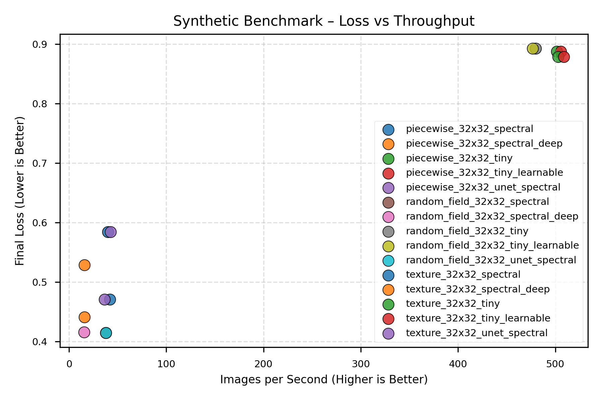
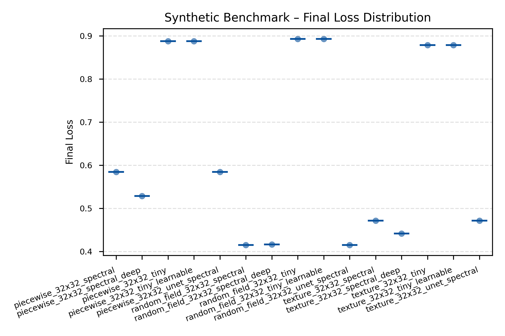
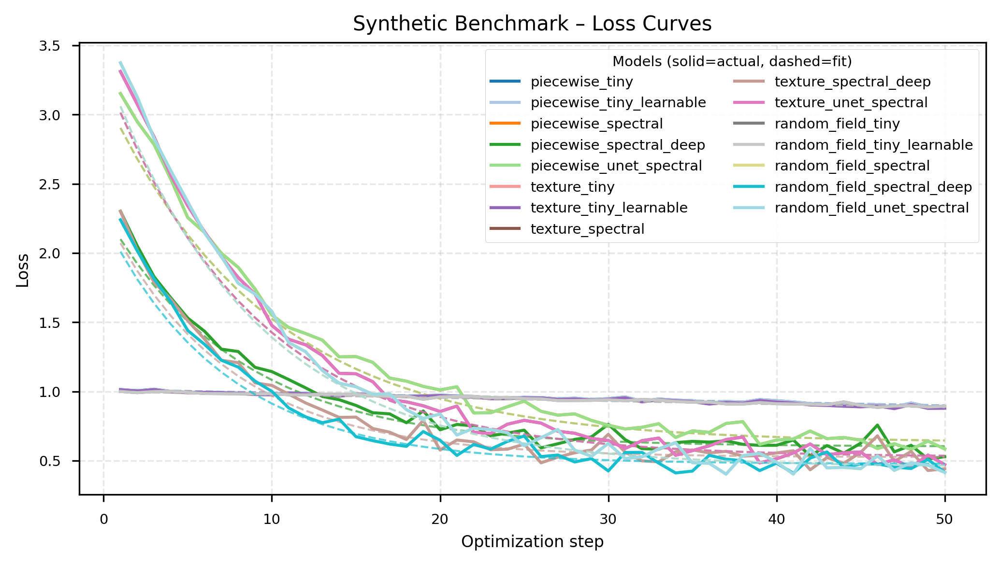
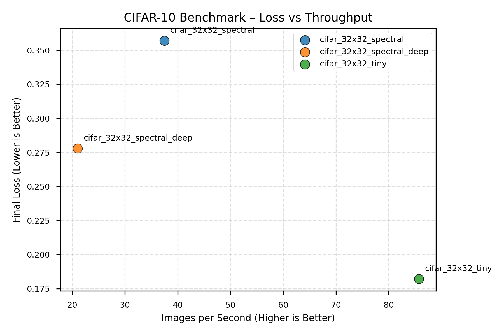
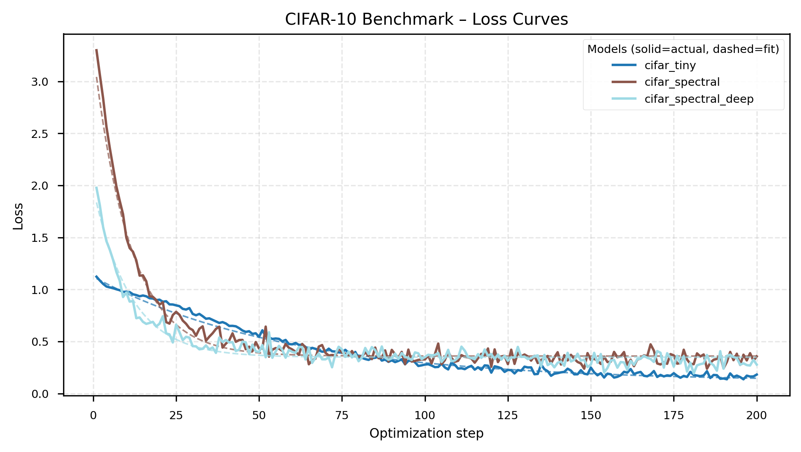
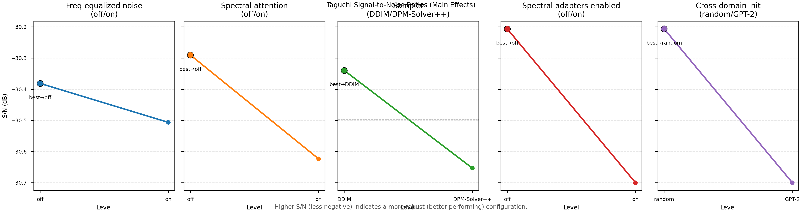
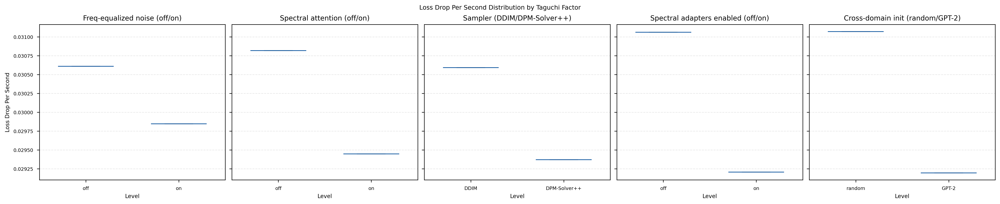

# Results Summary

_Generated 2025-10-26T15:01:15+00:00_
_Source: full_report_32x32_20251026_070159_

## Synthetic Benchmark (generate different type of images, piecewise, parametric textures, random fields)
We compare how quickly the spatial TinyUNet and the spectral version learn to reconstruct tiny synthetic images. 

**Data families tested:**
- **Piecewise**: Structured patterns (checkerboards, stripes, circles) - tests discrete spatial feature learning
- **Texture**: Parametric gratings (oriented, controlled frequency/bandwidth) - tests directional frequency sensitivity
- **Random field**: Power-law spectra (1/f^α falloff) - tests natural image frequency statistics

**FFT Performance Context:**
- torch.fft.fft2 (CPU): 3.1ms per 256×256 image
- numpy.fft.fft2: 8.8ms per 256×256 image

**⚠️ Implementation Caveat:**
Spectral adapters currently rely on Python-level FFT calls, causing host-device sync overhead.
Wall-time results are implementation-limited. Step-based fit-rate metrics (k, t½) are the primary
indicators of convergence efficiency. We benchmark the FFT performance in isolation.

| Run | Loss Drop | Final Loss | Images/s | Runtime (s) | Fit k | Fit R² | t½ | FID |
| --- | --- | --- | --- | --- | --- | --- | --- | --- |
| piecewise_32x32_tiny | 0.126 | 0.888 | 501.5 | 3.2 | – | – | – | – |
| piecewise_32x32_tiny_learnable | 0.126 | 0.888 | 505.5 | 3.2 | – | – | – | – |
| piecewise_32x32_spectral | 2.567 | 0.584 | 40.1 | 39.9 | – | – | – | – |
| piecewise_32x32_spectral_deep | 1.773 | 0.529 | 15.7 | 101.9 | – | – | – | – |
| piecewise_32x32_unet_spectral | 2.567 | 0.584 | 42.8 | 37.4 | – | – | – | – |
| texture_32x32_tiny | 0.133 | 0.879 | 502.9 | 3.2 | – | – | – | – |
| texture_32x32_tiny_learnable | 0.133 | 0.879 | 508.8 | 3.1 | – | – | – | – |
| texture_32x32_spectral | 2.840 | 0.471 | 41.9 | 38.1 | – | – | – | – |
| texture_32x32_spectral_deep | 1.860 | 0.441 | 15.8 | 101.4 | – | – | – | – |
| texture_32x32_unet_spectral | 2.840 | 0.471 | 36.4 | 43.9 | – | – | – | – |
| random_field_32x32_tiny | 0.107 | 0.893 | 479.6 | 3.3 | – | – | – | – |
| random_field_32x32_tiny_learnable | 0.107 | 0.893 | 476.7 | 3.4 | – | – | – | – |
| random_field_32x32_spectral | 2.959 | 0.414 | 37.9 | 42.3 | – | – | – | – |
| random_field_32x32_spectral_deep | 1.824 | 0.416 | 15.4 | 103.9 | – | – | – | – |
| random_field_32x32_unet_spectral | 2.959 | 0.414 | 37.8 | 42.4 | – | – | – | – |

**Quick takeaways**
- Lowest final loss: random_field_32x32_spectral (0.414)
- Fastest throughput: texture_32x32_tiny_learnable (508.8) images/s
- Trade-off: texture_32x32_tiny_learnable vs random_field_32x32_spectral → 13.4× faster, Δ loss -0.464
- Fastest convergence: texture_32x32_spectral (0.074) loss drop/s

## CIFAR-10 Reconstruction Benchmark
Same comparison on real CIFAR-10 data to show the accuracy vs. training speed trade-off.

| Run | Loss Drop | Final Loss | Images/s | Runtime (s) | Fit k | Fit R² | t½ | FID |
| --- | --- | --- | --- | --- | --- | --- | --- | --- |
| cifar_32x32_tiny | 0.941 | 0.182 | 85.7 | 74.7 | – | – | – | – |
| cifar_32x32_spectral | 2.942 | 0.357 | 37.4 | 170.9 | – | – | – | – |
| cifar_32x32_spectral_deep | 1.699 | 0.278 | 21.0 | 304.7 | – | – | – | – |

**Quick takeaways**
- Lowest final loss: cifar_32x32_tiny (0.182)
- Fastest throughput: cifar_32x32_tiny (85.7) images/s
- Fastest convergence: cifar_32x32_spectral (0.017) loss drop/s

## Taguchi Factor Sweep
We run a Taguchi orthogonal array to see which frequency-processing settings and sampler choices matter most for convergence speed.

| Rank | Factor | Level | S/N (dB) | Runtime (s) | Images/s | Final Loss |
| --- | --- | --- | --- | --- | --- | --- |
| 1 | Cross-domain init | random | -30.21 | 20.807 | 92.28 | 0.499 |
| 1 | Cross-domain init | GPT-2 | -30.70 | 20.769 | 92.45 | 0.483 |
| 2 | Spectral adapters enabled | off | -30.21 | 20.735 | 92.60 | 0.487 |
| 2 | Spectral adapters enabled | on | -30.70 | 20.842 | 92.13 | 0.495 |
| 3 | Spectral attention | off | -30.29 | 20.715 | 92.69 | 0.499 |

_Higher S/N (less negative) indicates a more robust configuration. Secondary columns show per-level averages for runtime, throughput, and final loss when available._

**Quick takeaways**
- Cross-domain init best at random (-30.21 dB, Δ +0.49 dB vs. GPT-2, runtime 20.807s vs 20.769s, images/s 92.28 vs 92.45, final loss 0.499 vs 0.483)
- Spectral adapters enabled best at off (-30.21 dB, Δ +0.49 dB vs. on, runtime 20.735s vs 20.842s, images/s 92.60 vs 92.13, final loss 0.487 vs 0.495)
- Spectral attention best at off (-30.29 dB, Δ +0.33 dB vs. on, runtime 20.715s vs 20.861s, images/s 92.69 vs 92.04, final loss 0.499 vs 0.483)

## FFT Benchmark Snapshot
Parameters: batch=4, channels=3, size=256×256, runs=10
- torch.fft.fft2 (CPU): 3.10 ms per call (total 0.031s)
- numpy.fft.fft2: 8.76 ms per call (total 0.088s)
- torch.fft.fft2 (CUDA): not available on this machine
_One-off measurement on local hardware; treat as qualitative guidance._

## FFT Overhead Correction
The benchmark suite measures transform overhead across resolutions.
FFT-corrected runtime t_corrected = t_measured × (1 - fft_fraction).
While not perfect, it allows theoretical extrapolation to GPU-native FFTs.
Scaling exponents p ≈ 1.8–2.0 indicate expected asymptotic flattening for spectral variants.

**⚠️ Implementation Caveat:**
Current spectral adapters use Python-level FFT calls, causing host-device sync overhead.
Wall-time results are implementation-limited. Step-based fit-rate metrics (k, t½) are the primary
indicators of convergence efficiency. We benchmark the FFT performance in isolation.

**📊 Scaling Analysis Methodology:**
- **FFT scaling:** Measured across resolutions 256² to 1536², fitted with power law time ~ N^p
- **Runtime scaling:** Training time vs resolution for baseline vs spectral models
- **Efficiency metrics:** k (convergence rate) and k/runtime (normalized efficiency)
- **FFT correction:** t_corrected = t_measured × (1 - fft_fraction) for fair comparison
