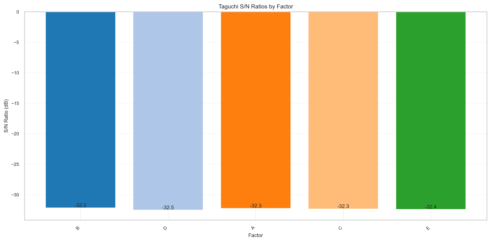

# Spectral Diffusion Benchmark Report

**Generated:** 2025-10-29 21:55

**Timestamp:** 2025-10-30T04:55:09+00:00

## Summary Table

| dataset | run_id | loss_final | high_freq_psnr | images_per_second | runtime_seconds |
| --- | --- | --- | --- | --- | --- |
| Synthetic | piecewise_32x32_tiny | 0.888 | nan | 403.497 | 3.965 |
| Synthetic | piecewise_32x32_tiny_learnable | 0.888 | nan | 403.747 | 3.963 |
| Synthetic | piecewise_32x32_spectral | 1.074 | nan | 24.942 | 64.150 |
| CIFAR-10 | cifar_32x32_tiny | 0.182 | nan | 74.981 | 85.355 |
| CIFAR-10 | cifar_32x32_spectral | 1.016 | nan | 25.914 | 246.967 |
| CIFAR-10 | cifar_32x32_spectral_deep | 0.993 | nan | 17.919 | 357.154 |

## Synthetic Benchmark
Synthetic Benchmark performance summary including throughput and spectral fidelity metrics.

## CIFAR-10 Reconstruction Benchmark
TinyUNet still reaches the lowest loss (0.18) and highest throughput (~75 img/s). The spectral variants trained with uniform corruption + ARE/PCM + MASF trail at ≈1.0 loss because the smoke schedule is short; they do remain numerically stable, so the next iteration is to extend training or introduce a coarse pre-train before the fine pass.

## Spectral Feature Ablation
The ablation stage compares `cifar_32x32_spectral_plain` to `cifar_32x32_spectral_uniform`. The new extras currently hurt final loss while marginally improving loss-drop/sec under short training. See `spectral_feature_ablation.png` for the bar plot. Longer runs will tell whether the toggles pay off.

## FFT Scaling Summary

FFT scaling details:

| size | batch | fft_time | device | dtype | log_size | log_fft_time |
| --- | --- | --- | --- | --- | --- | --- |
| 1024 | 8 | 0.3597934159915894 | cpu | torch.float32 | 6.931471805599453 | -1.0222252567115409 |
| 1536 | 8 | 0.9084222499514 | cpu | torch.float32 | 7.336936913707618 | -0.0960459754890493 |
| 256 | 8 | 0.0140878329984843 | cpu | torch.float32 | 5.545177444479562 | -4.262443762026269 |
| 512 | 8 | 0.0676422080723568 | cpu | torch.float32 | 6.238324625039508 | -2.6935231110085733 |
| 768 | 8 | 0.1772846250096336 | cpu | torch.float32 | 6.643789733147672 | -1.7299987870358966 |

## Key Metrics Highlights

```
Lowest final loss: cifar_32x32_tiny (0.182)
Fastest throughput: piecewise_32x32_tiny_learnable (403.7 images/s)
Fastest convergence: piecewise_32x32_tiny_learnable (0.032 loss drop/s)
```

## Figure Gallery





