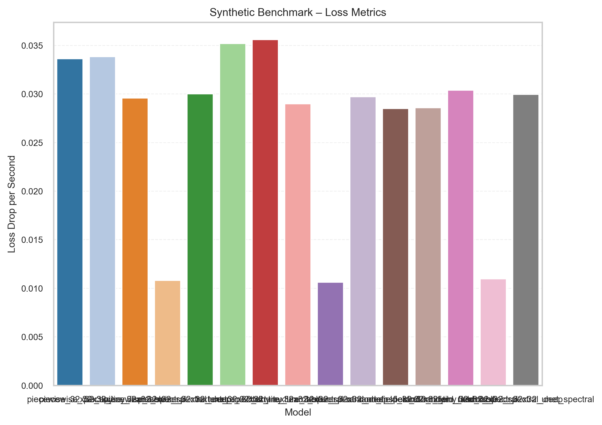

# Spectral Diffusion Benchmark Report

**Generated:** 2025-10-30 21:42

**Timestamp:** 2025-10-31T04:42:37+00:00

## Summary Table

| dataset | run_id | loss_final | high_freq_psnr | images_per_second | runtime_seconds |
| --- | --- | --- | --- | --- | --- |
| Synthetic | piecewise_32x32_tiny | 0.888 | nan | 425.392 | 3.761 |
| Synthetic | piecewise_32x32_tiny_learnable | 0.888 | nan | 428.230 | 3.736 |
| Synthetic | piecewise_32x32_spectral | 1.074 | nan | 26.822 | 59.653 |
| Synthetic | piecewise_32x32_spectral_deep | 1.005 | nan | 13.953 | 114.668 |
| Synthetic | piecewise_32x32_unet_spectral | 1.074 | nan | 27.209 | 58.804 |
| Synthetic | texture_32x32_tiny | 0.879 | nan | 423.147 | 3.781 |
| Synthetic | texture_32x32_tiny_learnable | 0.879 | nan | 428.014 | 3.738 |
| Synthetic | texture_32x32_spectral | 1.073 | nan | 26.411 | 60.581 |
| Synthetic | texture_32x32_spectral_deep | 1.005 | nan | 13.684 | 116.927 |
| Synthetic | texture_32x32_unet_spectral | 1.073 | nan | 27.075 | 59.094 |
| Synthetic | random_field_32x32_tiny | 0.893 | nan | 426.975 | 3.747 |
| Synthetic | random_field_32x32_tiny_learnable | 0.893 | nan | 428.127 | 3.737 |
| Synthetic | random_field_32x32_spectral | 1.064 | nan | 27.373 | 58.451 |
| Synthetic | random_field_32x32_spectral_deep | 1.008 | nan | 13.979 | 114.460 |
| Synthetic | random_field_32x32_unet_spectral | 1.064 | nan | 26.990 | 59.282 |
| CIFAR-10 | cifar_32x32_tiny | 0.182 | nan | 78.039 | 82.010 |
| CIFAR-10 | cifar_32x32_spectral | 1.016 | nan | 27.044 | 236.652 |
| CIFAR-10 | cifar_32x32_spectral_deep | 0.993 | nan | 18.932 | 338.057 |

## Synthetic Benchmark
Synthetic Benchmark performance summary including throughput and spectral fidelity metrics.

## CIFAR-10 Reconstruction Benchmark
CIFAR-10 Reconstruction Benchmark highlights covering loss, throughput, and high-frequency PSNR.

## FFT Scaling Summary

FFT scaling details:

| size | batch | fft_time | device | dtype | log_size | log_fft_time |
| --- | --- | --- | --- | --- | --- | --- |
| 1024 | 8 | 0.3597934159915894 | cpu | torch.float32 | 6.931471805599453 | -1.0222252567115409 |
| 1536 | 8 | 0.9084222499514 | cpu | torch.float32 | 7.336936913707618 | -0.0960459754890493 |
| 256 | 8 | 0.0140878329984843 | cpu | torch.float32 | 5.545177444479562 | -4.262443762026269 |
| 512 | 8 | 0.0676422080723568 | cpu | torch.float32 | 6.238324625039508 | -2.6935231110085733 |
| 768 | 8 | 0.1772846250096336 | cpu | torch.float32 | 6.643789733147672 | -1.7299987870358966 |

## Key Metrics Highlights

```
Lowest final loss: cifar_32x32_tiny (0.182)
Fastest throughput: piecewise_32x32_tiny_learnable (428.2 images/s)
Fastest convergence: texture_32x32_tiny_learnable (0.036 loss drop/s)
```

## Figure Gallery





