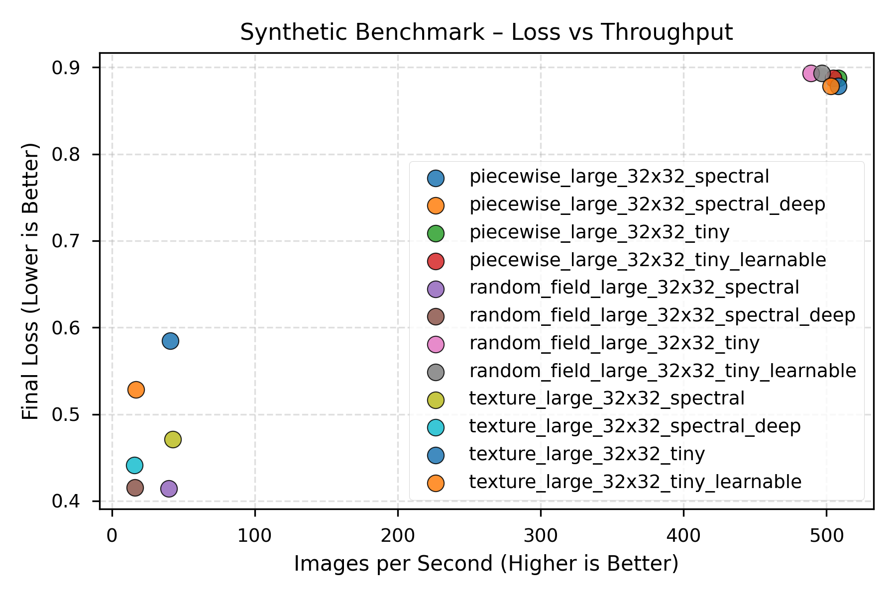
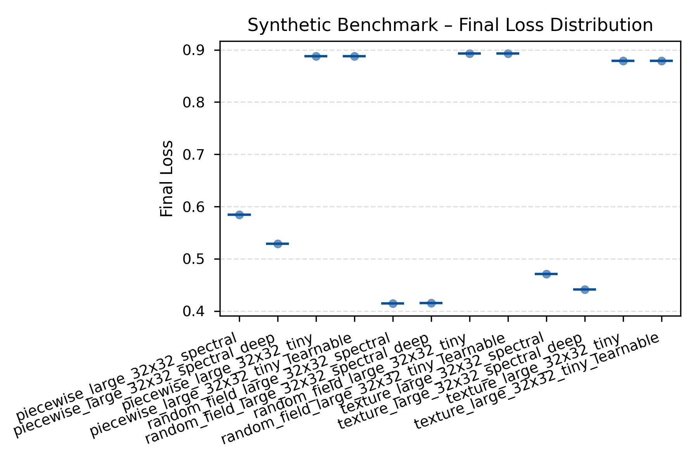
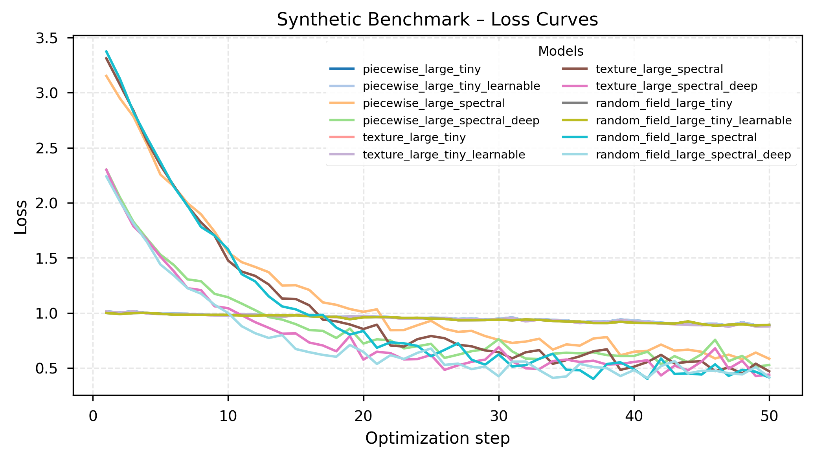
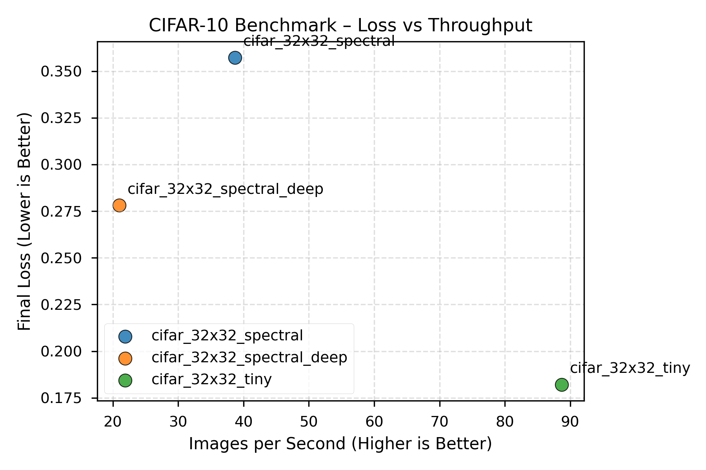
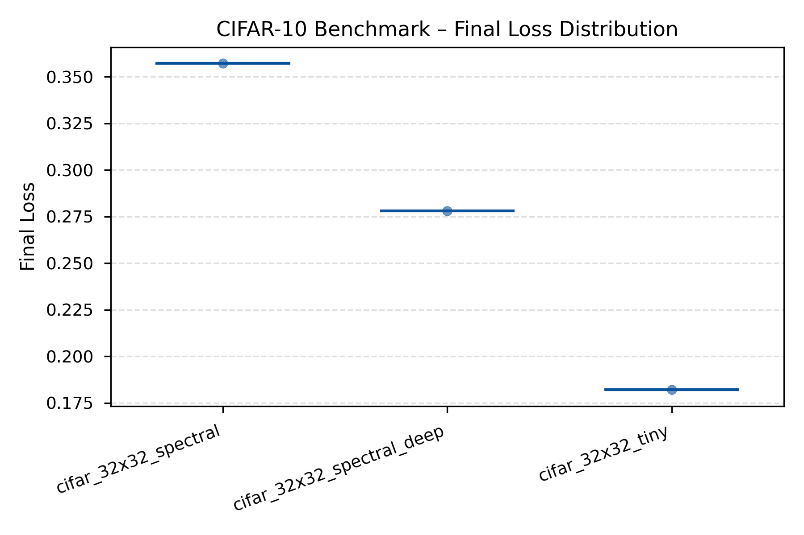
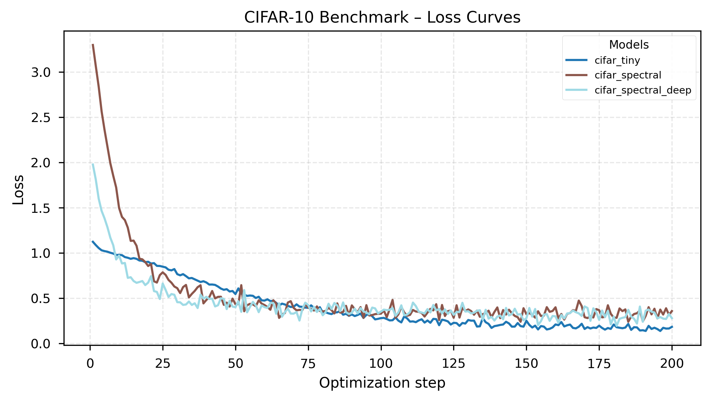
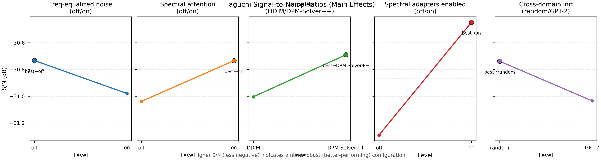
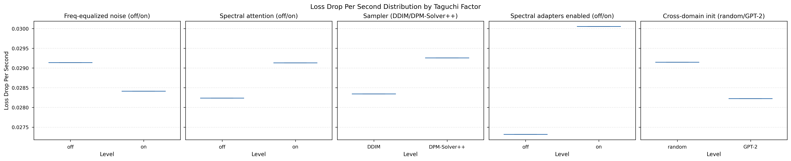

# Results Summary

_Generated 2025-10-25T19:18:06+00:00_
_Source: results/full_report_large_20251025_002755_

## Synthetic Benchmark (generate different type of images, piecewise, parametric textures, random fields)
We compare how quickly the spatial TinyUNet and the spectral version learn to reconstruct tiny synthetic images. 

**Data families tested:**
- **Piecewise**: Structured patterns (checkerboards, stripes, circles) - tests discrete spatial feature learning
- **Texture**: Parametric gratings (oriented, controlled frequency/bandwidth) - tests directional frequency sensitivity
- **Random field**: Power-law spectra (1/f^α falloff) - tests natural image frequency statistics

| Run | Loss Drop | Final Loss | Images/s | Runtime (s) | FID |
| --- | --- | --- | --- | --- | --- |
| piecewise_large_32x32_tiny | 0.126 | 0.888 | 508.3 | 3.1 | – |
| piecewise_large_32x32_tiny_learnable | 0.126 | 0.888 | 504.6 | 3.2 | – |
| piecewise_large_32x32_spectral | 2.567 | 0.584 | 40.7 | 39.3 | – |
| piecewise_large_32x32_spectral_deep | 1.773 | 0.529 | 16.8 | 95.5 | – |
| texture_large_32x32_tiny | 0.133 | 0.879 | 508.0 | 3.1 | – |
| texture_large_32x32_tiny_learnable | 0.133 | 0.879 | 503.0 | 3.2 | – |
| texture_large_32x32_spectral | 2.840 | 0.471 | 42.5 | 37.6 | – |
| texture_large_32x32_spectral_deep | 1.860 | 0.441 | 15.9 | 100.6 | – |
| random_field_large_32x32_tiny | 0.107 | 0.893 | 489.0 | 3.3 | – |
| random_field_large_32x32_tiny_learnable | 0.107 | 0.893 | 496.8 | 3.2 | – |
| random_field_large_32x32_spectral | 2.959 | 0.414 | 39.7 | 40.3 | – |
| random_field_large_32x32_spectral_deep | 1.824 | 0.416 | 16.0 | 100.3 | – |

**Quick takeaways**
- Lowest final loss: random_field_large_32x32_spectral (0.414)
- Fastest throughput: piecewise_large_32x32_tiny (508.3) images/s
- Trade-off: piecewise_large_32x32_tiny vs random_field_large_32x32_spectral → 12.8× faster, Δ loss -0.473
- Fastest convergence: texture_large_32x32_spectral (0.076) loss drop/s

## CIFAR-10 Reconstruction Benchmark
Same comparison on real CIFAR-10 data to show the accuracy vs. training speed trade-off.

| Run | Loss Drop | Final Loss | Images/s | Runtime (s) | FID |
| --- | --- | --- | --- | --- | --- |
| cifar_32x32_tiny | 0.941 | 0.182 | 88.7 | 72.1 | – |
| cifar_32x32_spectral | 2.942 | 0.357 | 38.7 | 165.3 | – |
| cifar_32x32_spectral_deep | 1.699 | 0.278 | 21.0 | 305.0 | – |

**Quick takeaways**
- Lowest final loss: cifar_32x32_tiny (0.182)
- Fastest throughput: cifar_32x32_tiny (88.7) images/s
- Fastest convergence: cifar_32x32_spectral (0.018) loss drop/s

## Taguchi Factor Sweep
We run a Taguchi orthogonal array to see which frequency-processing settings and sampler choices matter most for convergence speed.

| Rank | Factor | Level | S/N (dB) | Runtime (s) | Images/s | Final Loss |
| --- | --- | --- | --- | --- | --- | --- |
| 1 | Spectral adapters enabled | off | -31.29 | 21.589 | 88.94 | 0.512 |
| 1 | Spectral adapters enabled | on | -30.45 | 20.904 | 91.86 | 0.535 |
| 2 | Sampler | DDIM | -31.00 | 21.392 | 89.77 | 0.528 |
| 2 | Sampler | DPM-Solver++ | -30.69 | 21.004 | 91.46 | 0.516 |
| 3 | Spectral attention | off | -31.04 | 21.170 | 90.75 | 0.518 |

_Higher S/N (less negative) indicates a more robust configuration. Secondary columns show per-level averages for runtime, throughput, and final loss when available._

**Quick takeaways**
- Spectral adapters enabled best at on (-30.45 dB, Δ +0.84 dB vs. off, runtime 20.904s vs 21.589s, images/s 91.86 vs 88.94, final loss 0.535 vs 0.512)
- Sampler best at DPM-Solver++ (-30.69 dB, Δ +0.31 dB vs. DDIM, runtime 21.004s vs 21.392s, images/s 91.46 vs 89.77, final loss 0.516 vs 0.528)
- Spectral attention best at on (-30.73 dB, Δ +0.30 dB vs. off, runtime 21.323s vs 21.170s, images/s 90.05 vs 90.75, final loss 0.529 vs 0.518)

## FFT Benchmark Snapshot
Parameters: batch=4, channels=3, size=256×256, runs=10
- torch.fft.fft2 (CPU): 3.51 ms per call (total 0.035s)
- numpy.fft.fft2: 9.85 ms per call (total 0.098s)
- torch.fft.fft2 (CUDA): not available on this machine
_One-off measurement on local hardware; treat as qualitative guidance._
