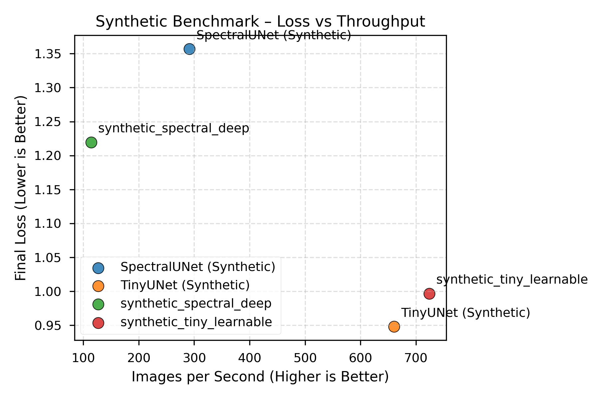
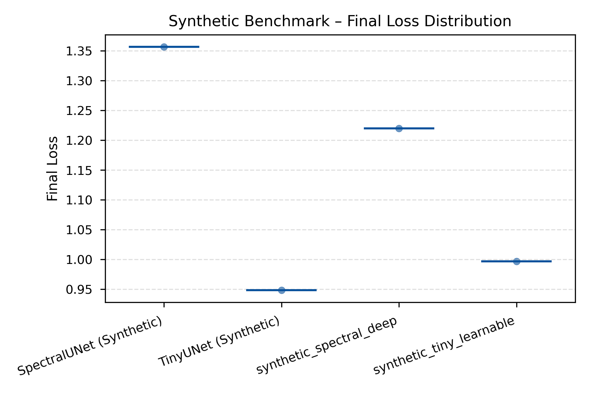
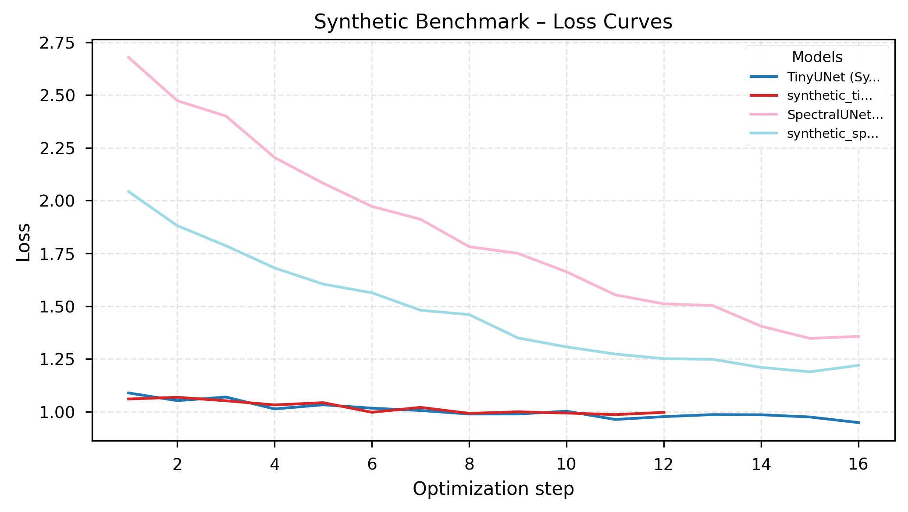
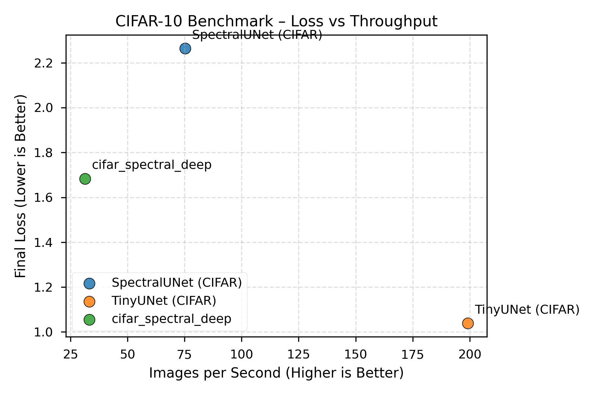
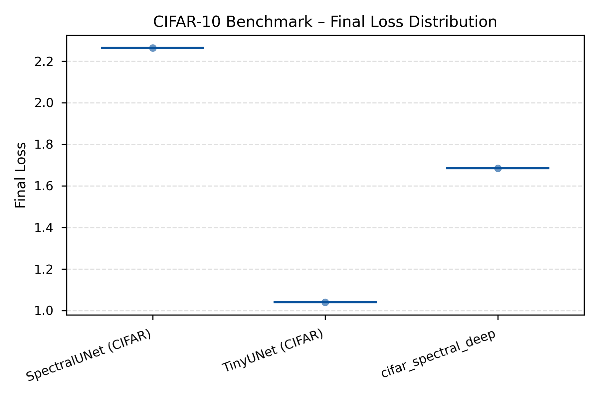
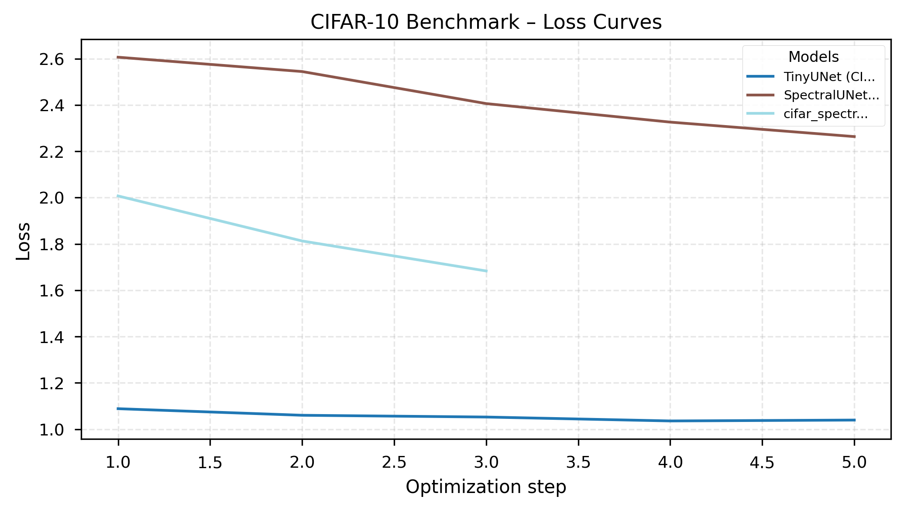
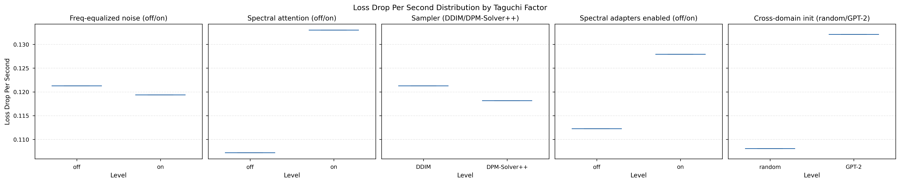

# Results Summary

_Generated 2025-10-25T19:15:06+00:00_
_Source: /Users/benschneider/gitrep/spectral-diffusion/results/smoke_report_20251025_121429_

## Synthetic Benchmark (generate different type of images, piecewise, parametric textures, random fields)
We compare how quickly the spatial TinyUNet and the spectral version learn to reconstruct tiny synthetic images. 

**Data families tested:**
- **Piecewise**: Structured patterns (checkerboards, stripes, circles) - tests discrete spatial feature learning
- **Texture**: Parametric gratings (oriented, controlled frequency/bandwidth) - tests directional frequency sensitivity
- **Random field**: Power-law spectra (1/f^α falloff) - tests natural image frequency statistics

| Run | Loss Drop | Final Loss | Images/s | Runtime (s) | FID |
| --- | --- | --- | --- | --- | --- |
| TinyUNet (Synthetic) | 0.140 | 0.948 | 660.7 | 0.8 | – |
| synthetic_tiny_learnable | 0.063 | 0.997 | 724.5 | 0.5 | – |
| SpectralUNet (Synthetic) | 1.322 | 1.357 | 291.4 | 1.8 | – |
| synthetic_spectral_deep | 0.823 | 1.220 | 114.4 | 4.5 | – |

**Quick takeaways**
- Lowest final loss: TinyUNet (Synthetic) (0.948)
- Fastest throughput: synthetic_tiny_learnable (724.5) images/s
- Trade-off: synthetic_tiny_learnable vs TinyUNet (Synthetic) → 1.1× faster, Δ loss -0.048
- Fastest convergence: SpectralUNet (Synthetic) (0.752) loss drop/s

## CIFAR-10 Reconstruction Benchmark
Same comparison on real CIFAR-10 data to show the accuracy vs. training speed trade-off.

| Run | Loss Drop | Final Loss | Images/s | Runtime (s) | FID |
| --- | --- | --- | --- | --- | --- |
| TinyUNet (CIFAR) | 0.049 | 1.039 | 199.1 | 0.4 | – |
| SpectralUNet (CIFAR) | 0.343 | 2.264 | 75.3 | 1.1 | – |
| cifar_spectral_deep | 0.324 | 1.683 | 31.4 | 3.1 | – |

**Quick takeaways**
- Lowest final loss: TinyUNet (CIFAR) (1.039)
- Fastest throughput: TinyUNet (CIFAR) (199.1) images/s
- Fastest convergence: SpectralUNet (CIFAR) (0.323) loss drop/s

## Taguchi Factor Sweep
We run a Taguchi orthogonal array to see which frequency-processing settings and sampler choices matter most for convergence speed.

| Rank | Factor | Level | S/N (dB) | Runtime (s) | Images/s | Final Loss |
| --- | --- | --- | --- | --- | --- | --- |
| 1 | Spectral attention | off | -19.78 | 0.532 | 180.75 | 1.050 |
| 1 | Spectral attention | on | -17.65 | 0.519 | 185.38 | 1.090 |
| 2 | Cross-domain init | random | -19.63 | 0.520 | 185.06 | 1.068 |
| 2 | Cross-domain init | GPT-2 | -17.88 | 0.531 | 181.08 | 1.071 |
| 3 | Spectral adapters enabled | off | -19.15 | 0.525 | 183.35 | 1.087 |

_Higher S/N (less negative) indicates a more robust configuration. Secondary columns show per-level averages for runtime, throughput, and final loss when available._

**Quick takeaways**
- Spectral attention best at on (-17.65 dB, Δ +2.13 dB vs. off, runtime 0.519s vs 0.532s, images/s 185.38 vs 180.75, final loss 1.090 vs 1.050)
- Cross-domain init best at GPT-2 (-17.88 dB, Δ +1.75 dB vs. random, runtime 0.531s vs 0.520s, images/s 181.08 vs 185.06, final loss 1.071 vs 1.068)
- Spectral adapters enabled best at on (-18.52 dB, Δ +0.63 dB vs. off, runtime 0.526s vs 0.525s, images/s 182.78 vs 183.35, final loss 1.052 vs 1.087)

## FFT Benchmark Snapshot
Parameters: batch=4, channels=3, size=256×256, runs=10
- torch.fft.fft2 (CPU): 3.99 ms per call (total 0.040s)
- numpy.fft.fft2: 10.38 ms per call (total 0.104s)
- torch.fft.fft2 (CUDA): not available on this machine
_One-off measurement on local hardware; treat as qualitative guidance._
